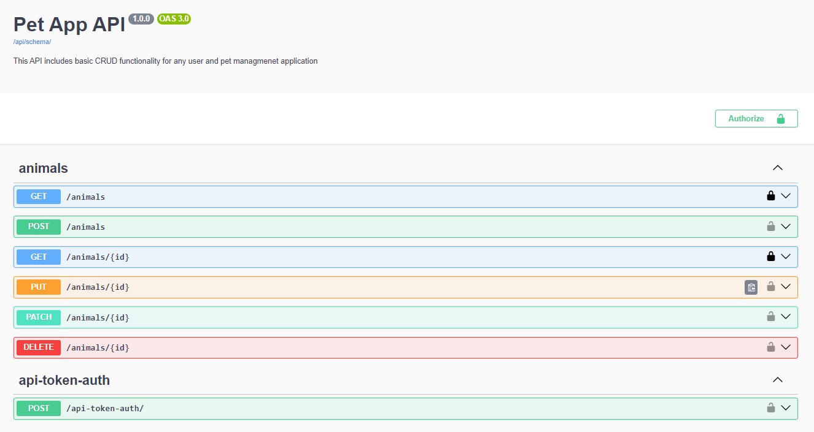

# Containerized REST API Server with Django

This Django API Rest Server is a template playground for any developers who want to reference any implementation of some web development concepts that can be done with Django application. Particularly:

- How to utuilize DAO library for database access
- How to secure an API Endpoint
- How to handle image upload/retrival with CDN such as AWS S3
- How to set up for containerized deployment (both API server and database

## Setup

- Clone the repository
- Install docker and docker-compose on your machine
- Spin up the containers:
  - `docker compose -f docker-compose.yml up --build`
  - Visit http://localhost:8000/ to check if the API server is up

## Development

- Database migration:
  - `docker exec -it <server_container_name> python manage.py migrate`
- Database seeding. There are 2 ways to interact with the containerize database
  - With Django Shell: `docker exec -it <server_container_name> python manage.py shell`
  - With PSQL: `docker exec -it <database_container_name> psql -U <username> -d <database_name>`
- Info can be found inside the docker-compose.yml file

## Networking Issues

- Problem: how to test communication with API from a UI app on personal phone?
  - Ensure API host machine and UI host machine on the same network (whether it's wifi, lan, etc...)
  - Run/Expose the API via the IP address of the Wifi route:
    - Search for the router IP address in the command line with : `ipconfig`. Say the IP config is: `123.123.4.1`
    - Expose your API with Django command: `python app\manage.py runserver 123.123.4.1:8000`

## API Schema

- Get the API schema by visiting the below 3 endpoints:
  - /api/schema/
  - /api/schema/swagger-ui/
  - /api/schema/redoc/

